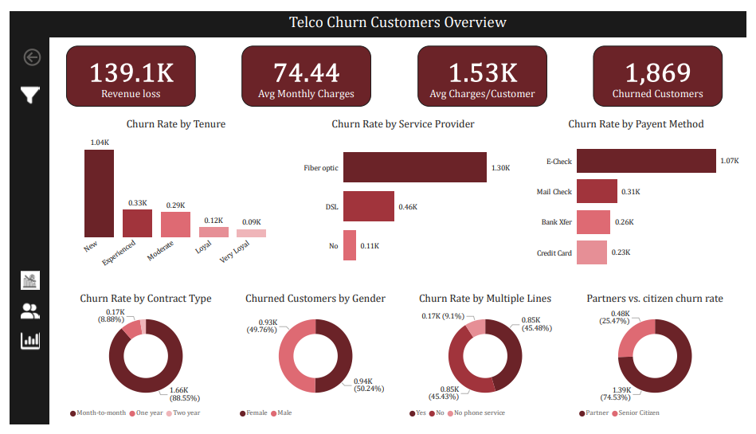
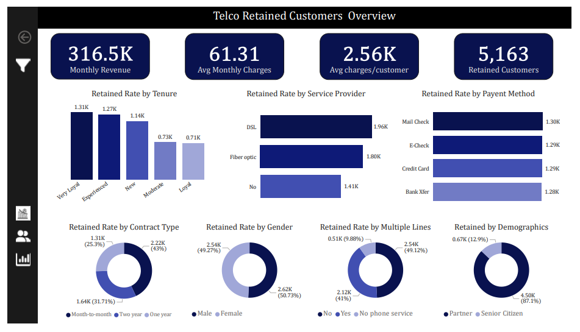
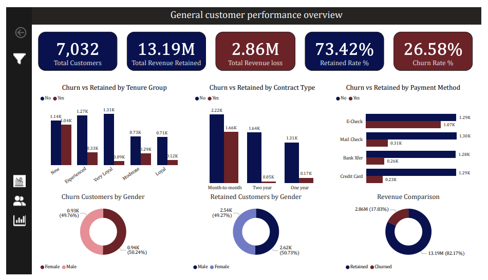

# 📊 Telco Customer Churn Analysis & Retention Strategy Dashboard

## Table of Contents

* [Project Overview](#project-overview)
* [Business Problem](#business-problem)
* [Project Objectives](#project-objectives)
* [Dataset Description](#dataset-description)
* [Tools Used](#tools-used)
* [Data Cleaning & Preparation](#data-cleaning--preparation)
* [Data Analysis](#data-analysis)
* [Dashboard Pages](#dashboard-pages)
* [Key Insights & Findings](#key-insights--findings)
* [Recommendations](#recommendations)
* [Conclusion](#conclusion)

---

## Project Overview

Customer churn has a direct impact on revenue, profitability, and long-term business growth. In highly competitive industries such as telecommunications, understanding why customers leave is essential for improving retention and reducing revenue loss.

In this project, I analyzed a customer base of over 7,000 subscribers to uncover churn patterns, identify high-risk customer segments, and evaluate the financial impact of customer attrition.

Using Power BI, I developed an interactive dashboard that tracks customer retention, churn behavior, contract performance, service adoption, and revenue contribution across different customer groups.

---

## Business Problem

The company was experiencing customer attrition and needed better visibility into the factors influencing churn.

Without a clear understanding of who was leaving and why, it becomes difficult to develop effective retention strategies or accurately assess the revenue impact of customer loss.

The objective of this analysis was to identify key churn drivers, evaluate customer retention patterns, and provide actionable insights that could help reduce churn and improve customer lifetime value.

---

# Project Objectives

This project was designed to:

* Measure overall churn and retention performance.
* Quantify revenue lost due to customer churn.
* Identify customer segments with the highest churn risk.
* Analyze contract, tenure, payment, and service-related churn patterns.
* Compare retained and churned customer behavior.
* Provide recommendations to improve customer retention.

---

# Dataset Description

The dataset contains customer-level information for 7,032 telecom subscribers.

Key data fields include:

* Customer Demographics
* Tenure
* Contract Type
* Payment Method
* Internet Service
* Phone Service
* Monthly Charges
* Total Charges
* Churn Status

The dataset was used to compare retained and churned customers and identify behavioral patterns associated with customer attrition.

---

# Tools Used

| Tool        | Purpose                               |
| ----------- | ------------------------------------- |
| Power BI    | Dashboard Development & Visualization |
| Power Query | Data Cleaning & Transformation        |
| DAX         | KPI Creation & Calculated Measures    |
| Excel       | Data Source Management                |

---

# Data Cleaning & Preparation

Before developing the dashboard, the dataset was reviewed and prepared to ensure accurate reporting and analysis.

The preparation process included:

* Validating data quality and completeness
* Reviewing missing and inconsistent records
* Correcting data types
* Standardizing categorical fields
* Creating calculated measures using DAX
* Building KPIs for churn, retention, and revenue analysis

---

# Data Analysis

The analysis focused on three key areas:

### Churn Analysis

Examined the characteristics of customers who left the company, including:

* Contract Type
* Payment Method
* Service Provider
* Customer Tenure
* Demographic Factors

### Retention Analysis

Evaluated the characteristics of retained customers and the factors associated with customer loyalty.

### Revenue Impact Analysis

Measured the financial effect of churn by comparing retained revenue against revenue lost from churned customers.

---

## Dashboard Pages

## 1. Churned Customers Overview

This dashboard focuses on customers who left the company and highlights the key factors contributing to customer attrition.

### Key Metrics
- 1,869 Churned Customers
- $2.86M Revenue Lost
- $1.53K Average Revenue per Customer
- $74.44 Average Monthly Charges

### Analysis Covered
- Churn by Contract Type
- Churn by Service Provider
- Churn by Payment Method
- Churn by Tenure Group
- Churn by Gender
- Churn by Customer Demographics

---

## 2. Retained Customers Overview

This dashboard provides insights into customers who remained with the company and identifies factors associated with customer loyalty and retention.

### Key Metrics
- 5,163 Retained Customers
- $13.19M Retained Revenue
- $2.56K Average Revenue per Customer
- $316.5K Monthly Revenue

### Analysis Covered
- Retention by Contract Type
- Retention by Service Provider
- Retention by Payment Method
- Retention by Tenure Group
- Retention by Gender
- Retention by Customer Demographics

---

## 3. General Customer Performance Overview

This dashboard compares churned and retained customers, providing a complete view of customer behavior, revenue performance, and retention trends.

### Key Metrics
- 7,032 Total Customers
- 26.58% Churn Rate
- 73.42% Retention Rate
- $16.05M Total Revenue Analyzed

### Analysis Covered
- Churn vs Retained by Contract Type
- Churn vs Retained by Tenure Group
- Churn vs Retained by Payment Method
- Revenue Comparison
- Customer Distribution by Gender
- Customer Retention Performance
---

# Key Insights & Findings

After analyzing the customer data, I uncovered several key trends that provide a better understanding of customer retention and churn behavior:

- I found that the company has a **churn rate of 26.58%**, meaning that roughly one out of every four customers discontinued their services.
- Churned customers were responsible for approximately **$2.86 million in lost revenue**, highlighting the significant financial impact of customer attrition.
- Customers on **month-to-month contracts** showed the highest churn levels, accounting for more than 1,600 churn cases. This suggests that customers without long-term commitments are more likely to leave.
- The analysis revealed that customers in the **early stages of their tenure** were the most likely to churn, indicating that the first few months of the customer journey are critical for retention efforts.
- I also observed that customers who used **Electronic Check** as their payment method had noticeably higher churn rates compared to those using other payment options.
- In contrast, customers with **longer-term contracts** demonstrated stronger loyalty and were far more likely to remain with the company.
- Retained customers contributed **over 82% of total revenue**, reinforcing the importance of customer retention strategies and their direct impact on business performance.

These findings highlight key areas where targeted retention initiatives could help reduce churn, improve customer loyalty, and protect long-term revenue growth.

---

## Recommendations

Based on the findings from this analysis, I recommend the following actions to reduce customer churn and improve long-term customer retention:

### Increase Long-Term Contract Adoption
The analysis shows that customers on month-to-month contracts are significantly more likely to churn than those on longer-term agreements. I recommend introducing targeted incentives, such as discounted rates, loyalty rewards, or value-added service bundles, to encourage customers to transition to annual or multi-year contracts.

### Improve Early Customer Engagement
Customers with shorter tenures exhibit the highest churn rates, indicating that the early stages of the customer lifecycle are critical. I recommend enhancing onboarding processes, providing proactive customer support, and implementing engagement initiatives that help customers realize value from the service more quickly.

### Review the Payment Experience
Electronic Check users demonstrate noticeably higher churn rates compared to customers using other payment methods. I recommend investigating potential friction points within the payment process and promoting more seamless alternatives, such as automatic bank transfers or credit card payments, to improve the overall customer experience.

### Strengthen Customer Retention Programs
Retention efforts should be focused on customer segments identified as having the highest churn risk. I recommend leveraging customer tenure, contract type, and behavioral patterns to create targeted retention campaigns, personalized offers, and proactive outreach strategies that address customer needs before they consider leaving.

### Monitor Churn Continuously
To support proactive decision-making, I recommend implementing a real-time churn monitoring framework through interactive dashboards and automated reporting. Continuous monitoring will enable the business to identify at-risk customers early and take timely actions to improve retention outcomes.

## Conclusion

This project provides a comprehensive analysis of customer churn, customer retention patterns, and revenue impact within a telecommunications company.

By analyzing more than 7,000 customer records, the dashboard uncovers the primary factors influencing customer attrition, including contract type, customer tenure, and payment method preferences. The findings highlight key areas where targeted business interventions can significantly improve customer retention and reduce revenue loss.

The insights generated from this analysis can support data-driven decision-making by helping stakeholders identify high-risk customer segments, develop effective retention strategies, and optimize the overall customer experience. By implementing the recommended actions, the organization can strengthen customer loyalty, reduce churn, and protect long-term recurring revenue growth.
